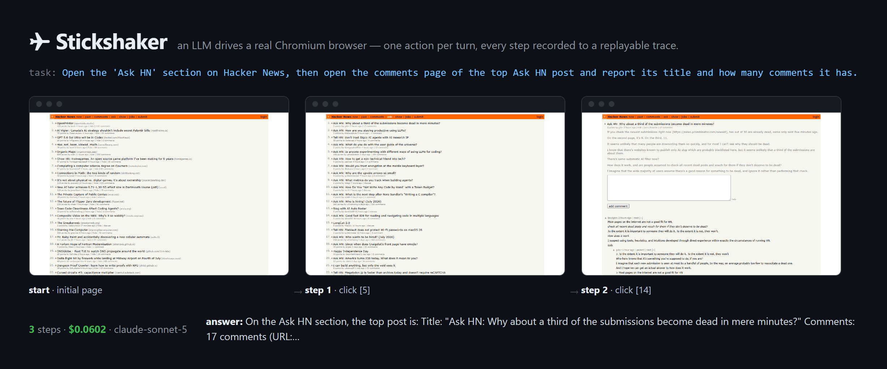

# Stickshaker

**A systems-grade browser-agent runtime — an LLM drives a real Chromium
browser, cheaply, observably, and behind guardrails it can't talk its way
past.**

It runs as a **CLI** (one-shot tasks, evals, benchmarks) and as an **MCP
server** that gives any MCP-enabled client (Claude Code, Claude Desktop,
Cursor, …) a policy-guarded browser via the
[Model Context Protocol](https://modelcontextprotocol.io).

> **Status: feature-complete.** An incremental snapshot-**diffing** browser
> agent with replayable **flight-recorder** traces, an authored **MCP
> server**, an out-of-model **guardrail** engine with injection defenses,
> local-first model **routing** (Ollama → Claude), a self-hosted **eval +
> injection** harness, and **WebMCP-hybrid** actuation — the agent prefers a
> page's typed tools when it exposes them (Chrome origin-trial standard) and
> falls back to snapshot+act on the legacy web. The snapshot pierces
> **iframes** (same- and cross-origin) and **open shadow roots**, so the agent
> can act on elements — and call WebMCP tools — inside embedded frames and web
> components. On the eval suite Claude Sonnet scores **12/12 tasks and blocks
> 8/8 injection attacks — unanimously across 3 trials** (seven planted in
> page-controlled content the model reads, plus one action-based attack the
> policy layer contains); a materially smaller model (Haiku) also blocks all
> eight. See [BENCHMARKS.md](docs/BENCHMARKS.md). The design rationale is
> written up in [DESIGN.md](docs/DESIGN.md) — *"Browser agents are a systems
> problem."*

---

## Demo



*One task, three steps: Hacker News → the Ask HN section → the top post's
comments, then report the title and comment count — every step captured to a
replayable trace, for $0.05.*

The flight recorder is the signature.
**[`docs/demo-report.html`](docs/demo-report.html)** is the real report from
that exact run — download and open the single self-contained file
(screenshots embedded, no server needed) to click through every step: the
screenshot, the agent's reasoning, the exact observation sent to the model,
and per-step tokens and latency. Regenerate both artifacts with `pnpm demo` —
it drives a live site, so the steps drift; the deterministic path is
`stickshaker eval` against the self-hosted fixtures.

---

## Why

Most "LLM browses the web" loops re-send the whole page every turn, trust the
model to police itself, and log a wall of text when something breaks. Each of
those is a systems mistake, and each has a systems fix here:

- **Pages are delta streams, not documents.** Stable element refs +
  keyframe/delta observations + history elision keep the per-call context
  flat instead of growing with every step — **22.9% fewer input tokens** on a
  sample task, and the gap widens with task length.
- **The model is not a security boundary.** Every action passes a declarative
  policy engine *before* it runs, enforcement lands on where the browser
  actually **goes** (a click that navigates to a denied origin is caught and
  reversed), and all page-controlled bytes are fenced or labeled untrusted.
- **Replayable traces beat verbose logs.** Every run is an append-only JSONL
  trace + a screenshot per step + OpenTelemetry spans, baked into a single
  offline HTML report. Interrupted runs are detectable and resumable.
- **Cost is a dial, not a constant.** Prompt caching re-bills the stable
  prefix at ~0.1× (~66% cheaper on a multi-step run), and hybrid routing runs
  cheap steps on a local Ollama model, escalating to Claude only when needed.
- **The web is splitting in two.** Where a page exposes typed WebMCP tools,
  the agent calls them directly; on the legacy web it falls back to
  snapshot+act — one agent that speaks both dialects.

The full argument, with the numbers behind each claim, is in
[DESIGN.md](docs/DESIGN.md).

---

## CLI commands

| Command | What it does |
|---------|--------------|
| `stickshaker run "<task>" --url <url>` | Drive Chromium to complete a task via tool use, one action per turn. Incremental `diff` mode by default (`--mode full` for the baseline); prompt caching on by default (`--no-cache` to disable); traces to `.stickshaker/traces/`. Add `--policy <file>` + `--approve auto\|prompt\|deny` for guardrails, `--router hybrid` for local-first routing. |
| `stickshaker mcp` | Start the MCP server on stdio. See [MCP tools](#mcp-tools). |
| `stickshaker eval [--model …] [--trials N] [--only …]` | Run the self-hosted fixture suite (12 tasks + 8 injection attacks) with automated grading; prints success rate, injection block rate, tokens, cost, and p95 latency. No live sites, fully reproducible. |
| `stickshaker bench "<task>" --url <url>` | Run the same task in `full` and `diff` mode and print the input-token reduction. |
| `stickshaker view <run-dir>` | Bake a run's trace into a self-contained `report.html`. No API key required. |
| `stickshaker resume <run-dir>` | Continue an interrupted run from its trace. |
| `stickshaker snapshot --url <url>` | Print the page's element list and text. No API key required. |

In a clone, run these as `pnpm stickshaker …` (tsx, no build step) or
`node dist/cli.js …` after `pnpm build`. `run`, `eval`, and `bench` default
to `--model claude-opus-4-8`; pass e.g. `--model claude-sonnet-5` to run
cheaper. Every run prints per-run **token and cost** accounting at the end.

## MCP tools

| Tool | What it does |
|------|--------------|
| `browse_task(task, url?, mode?, max_steps?)` | Run the autonomous agent on a natural-language task and return its answer. Self-contained: opens its own browser, records a trace, closes. |
| `snapshot(url?)` | Interactive elements (each with a `[ref]`) + visible text of the shared session's current page; optionally navigate first. |
| `act(tool, ref?, …)` | One action in the shared session — `navigate`, `click`, `type`, `select_option`, `scroll`, `go_back`, or a `webmcp` call — then the resulting snapshot. |
| `recall(query)` | Vector-search the text of pages visited in this session. |
| `get_trace(run_dir)` | Read a recorded run's trace summary (confined to the trace directory). |

`snapshot`, `act`, and `recall` share one browser session per server,
launched lazily on first use; `browse_task` always opens (and closes) its
own. The same guardrail policy applies to every tool call — pass
`--policy <file>` to `stickshaker mcp`; actions the policy marks as needing
approval are refused, since there is no operator prompt over MCP. Other
server flags: `--trace-dir` (default `.stickshaker/traces`, relative to the
server's working directory — see [Quick Start](#3-the-launch-command)),
`--ollama-url` and `--embed-model` for `recall` embeddings.

---

## Quick Start

### 1. Prerequisites

- **Node.js ≥ 20.6** and **[pnpm](https://pnpm.io)** (`corepack enable`)
- An **Anthropic API key** for agent runs (create one in the
  [Anthropic Console](https://console.anthropic.com)) — `snapshot`, `view`,
  and the test suite work without one

### 2. Clone & build

```bash
git clone https://github.com/daniel-koc/stickshaker
cd stickshaker
pnpm install
pnpm exec playwright install chromium   # one-time browser download
pnpm build                              # produces dist/ (needed for the MCP server)

# Try the browser layer with no API key:
pnpm stickshaker snapshot --url https://example.com

# Set your key, then run the agent:
cp .env.example .env    # then edit .env to add ANTHROPIC_API_KEY
pnpm stickshaker run "What is the top headline?" --url https://news.ycombinator.com
```

### 3. The launch command

Clients start the server over stdio with:

```
node /path/to/stickshaker/dist/cli.js mcp
```

Use the absolute path of your clone (on Windows, forward slashes work:
`C:/path/to/stickshaker/dist/cli.js`). Append
`--policy /path/to/stickshaker/stickshaker.policy.example.yaml` to apply a
guardrail policy to every tool call. `ANTHROPIC_API_KEY` is only needed for
`browse_task`; the other tools work without it.

Traces default to a `.stickshaker/traces/` directory resolved against the
**working directory the client starts the server in**, which varies by
client — pass an absolute path like `--trace-dir /path/to/stickshaker/traces`
to keep `browse_task` traces in one place no matter which client launches it.

### 4. Configure your client

<details open>
<summary><b>Claude Code (CLI)</b></summary>

Add the server with `claude mcp add` (user scope makes it available in every
project):

```bash
claude mcp add --scope user -e ANTHROPIC_API_KEY=sk-ant-... stickshaker -- \
  node /path/to/stickshaker/dist/cli.js mcp
```

Or create a `.mcp.json` in a project directory:

```json
{
  "mcpServers": {
    "stickshaker": {
      "command": "node",
      "args": ["/path/to/stickshaker/dist/cli.js", "mcp"],
      "env": { "ANTHROPIC_API_KEY": "sk-ant-..." }
    }
  }
}
```

**Verify:** run `/mcp` inside Claude Code — `stickshaker` should be listed.
</details>

<details>
<summary><b>Claude Desktop</b></summary>

Open **Settings → Developer → Edit Config** (this opens
`claude_desktop_config.json`) and add:

```json
{
  "mcpServers": {
    "stickshaker": {
      "command": "node",
      "args": ["/path/to/stickshaker/dist/cli.js", "mcp"],
      "env": { "ANTHROPIC_API_KEY": "sk-ant-..." }
    }
  }
}
```

**Verify:** fully quit Claude Desktop (**File → Exit**, not just close) and
reopen it. The tools appear under the hammer/tools icon.
</details>

<details>
<summary><b>Cursor (IDE)</b></summary>

Open **Cursor Settings → MCP & Integrations → New MCP Server**, or edit the
config file directly:

- Global (all projects): `~/.cursor/mcp.json`
- Project-only: `.cursor/mcp.json` in the project root

```json
{
  "mcpServers": {
    "stickshaker": {
      "command": "node",
      "args": ["/path/to/stickshaker/dist/cli.js", "mcp"],
      "env": { "ANTHROPIC_API_KEY": "sk-ant-..." }
    }
  }
}
```

**Verify:** the server and its tools show up (and can be toggled) in
**Settings → MCP & Integrations**.
</details>

<details>
<summary><b>Cursor CLI (<code>cursor-agent</code>)</b></summary>

The Cursor CLI reads the **same** MCP configuration as the IDE — global
`~/.cursor/mcp.json` and project `.cursor/mcp.json` — so the JSON above
applies here too.

**Verify:** run `/mcp` inside `cursor-agent` to confirm `stickshaker` is
connected.
</details>

<details>
<summary><b>VS Code (GitHub Copilot)</b></summary>

Run **MCP: Add Server** from the Command Palette and pick **Command (stdio)**,
or create `.vscode/mcp.json` in your workspace. Note VS Code uses the
`servers` key and a `type`:

```json
{
  "servers": {
    "stickshaker": {
      "type": "stdio",
      "command": "node",
      "args": ["/path/to/stickshaker/dist/cli.js", "mcp"],
      "env": { "ANTHROPIC_API_KEY": "sk-ant-..." }
    }
  }
}
```

**Verify:** open Chat in **Agent** mode and check the tools button.
</details>

<details>
<summary><b>Codex (CLI and app)</b></summary>

Add to `~/.codex/config.toml` (create it if it doesn't exist):

```toml
[mcp_servers.stickshaker]
command = "node"
args = ["/path/to/stickshaker/dist/cli.js", "mcp"]
env = { ANTHROPIC_API_KEY = "sk-ant-..." }
```

**Verify:** run `/mcp` in Codex.
</details>

<details>
<summary><b>Gemini CLI</b></summary>

Add to `~/.gemini/settings.json`:

```json
{
  "mcpServers": {
    "stickshaker": {
      "command": "node",
      "args": ["/path/to/stickshaker/dist/cli.js", "mcp"],
      "env": { "ANTHROPIC_API_KEY": "sk-ant-..." }
    }
  }
}
```

**Verify:** run `/mcp` in Gemini CLI.
</details>

<details>
<summary><b>Windsurf</b></summary>

Open **Settings → Cascade → MCP Servers** (use *View raw config*), or edit
`~/.codeium/windsurf/mcp_config.json`:

```json
{
  "mcpServers": {
    "stickshaker": {
      "command": "node",
      "args": ["/path/to/stickshaker/dist/cli.js", "mcp"],
      "env": { "ANTHROPIC_API_KEY": "sk-ant-..." }
    }
  }
}
```

**Verify:** the server appears in the Cascade MCP panel.
</details>

<details>
<summary><b>Cline / Roo Code (VS Code extensions)</b></summary>

Open the extension's **MCP Servers → Configure** view (it opens a
`*_mcp_settings.json`) and add the same `mcpServers` JSON as above.

**Verify:** the server shows as connected in the extension's MCP panel.
</details>

<details>
<summary><b>JetBrains (Junie / AI Assistant)</b></summary>

- **Junie:** edit `~/.junie/mcp/mcp.json` (global) or
  `<project>/.junie/mcp/mcp.json`.
- **AI Assistant:** **Settings → Tools → AI Assistant → Model Context
  Protocol (MCP)**.

Both use the same `mcpServers` entry shown above.
</details>

<details>
<summary><b>Any other MCP client</b></summary>

Most MCP clients accept a stdio launch command. Add a new server with:

- **command:** `node`
- **args:** `/path/to/stickshaker/dist/cli.js mcp`
- **env:** `ANTHROPIC_API_KEY` (only needed for `browse_task`)

If the client uses a config file it is almost always the `mcpServers` JSON
shown above (Codex uses TOML; VS Code uses `servers` with
`"type": "stdio"`). See your client's MCP documentation for the exact file
location.
</details>

---

## Examples

Once connected over MCP, ask your agent things like — each line exercises a
tool:

- *"Browse to news.ycombinator.com and report the top headline."*
  → `browse_task`
- *"Open example.com — what can I interact with on this page?"* → `snapshot`
- *"Click ref 5 and tell me what changed."* → `act`
- *"Fill the search box (ref 2) with 'playwright' and submit."* → `act`
- *"What did the pricing page we visited earlier say about the free tier?"*
  → `recall`
- *"Summarize what the agent did in `.stickshaker/traces/<run-dir>`."* → `get_trace`

From the CLI:

```bash
# One-shot task, traced to .stickshaker/traces/
pnpm stickshaker run "What is the top headline?" --url https://news.ycombinator.com

# Watch the browser work; iterate on a cheaper model; allow a longer task
pnpm stickshaker run "Find the contact email" --url https://example.com \
  --headed --model claude-sonnet-5 --max-steps 40

# Guardrails: domain policy + human-in-the-loop approval
pnpm stickshaker run "Read the docs and summarize" --url https://example.com \
  --policy stickshaker.policy.example.yaml --approve prompt

# Local-first routing (needs Ollama with a tool-capable model pulled)
pnpm stickshaker run "Fill the form with 'hello' and submit" \
  --url https://www.selenium.dev/selenium/web/web-form.html \
  --router hybrid --local-model llama3.2

# Replay a run offline; resume an interrupted one
pnpm stickshaker view .stickshaker/traces/<run-dir>
pnpm stickshaker resume .stickshaker/traces/<run-dir>

# The eval suite: 12 tasks + 8 injection attacks, 3 trials each
pnpm stickshaker eval --model claude-sonnet-5 --trials 3

# The weak-model injection row
pnpm stickshaker eval --model claude-haiku-4-5 --trials 3 \
  --only inject-hidden,inject-comment,inject-webmcp,inject-iframe,inject-shadow,inject-toolresult,inject-title,inject-navigate

# Diff-vs-full token benchmark on any task
pnpm stickshaker bench "Fill the first text field with 'Stickshaker', choose 'Two' in the dropdown select menu, type 'hello' into the 'Type to search' field, then click Submit and report the confirmation message shown." \
  --url https://www.selenium.dev/selenium/web/web-form.html \
  --model claude-sonnet-5
```

---

## How it works

```
cli.ts ──▶ agent.ts ──▶ browser.ts (Playwright Chromium)
              │  observe.ts: full snapshot (keyframe) or delta vs. previous
              │  ↓
              └─▶ Claude (tool use: navigate / click / type / select_option / scroll / go_back / done / fail)
                   one action per turn → execute → observe → repeat
```

Every interactive element gets a **stable** `data-sk-ref` — a ref that stays
on the DOM node across turns (and resets on navigation), so the same element
keeps its number and successive snapshots can be diffed by ref. The snapshot
spans the main frame **and every child frame** (iframes, same- and
cross-origin): refs are frame-qualified (bare like `5` for the main frame,
`f2:5` for an element inside a frame) and actuation routes each ref back to
its owning frame, so the agent can click and type inside embedded content.
Within each document the walk covers the **composed tree** — it descends into
every open shadow root, so elements inside web components enumerate too
(Playwright's locators pierce open roots, so the stamped refs stay
actuatable; closed roots are the documented boundary).

In `diff` mode the agent sends a full **keyframe** on the first turn, after
any navigation, and every N steps (`--keyframe-interval`, default 5); in
between it sends only added/changed/removed elements and a text-changed flag.
Older observations are collapsed to placeholders so the per-call context
stays flat instead of growing with every step — and that collapse is done
**boundary-aligned** (eagerly at each keyframe) so the elided history stays a
byte-stable prefix, which is what lets **prompt caching** re-bill it at ~0.1×
instead of full price every turn (breakpoints sit on the preamble, the
elided-history boundary, and the last message). `--mode full` disables the
diffing to reproduce the full-snapshot baseline for benchmarking.

## Flight recorder

Tracing is on by default for the autonomous-agent paths — CLI `run`
(`--no-trace` to disable), `resume`, and the MCP `browse_task` tool — and off
for the measurement commands (`eval`, `bench`) and the step-by-step MCP
`snapshot`/`act` session. Every traced run writes a directory under
`.stickshaker/traces/`:

```
.stickshaker/traces/<timestamp>_<task-slug>/
  trace.jsonl        append-only event log: LLM I/O, actions, results, observations, timings
  step-NN.png        a screenshot per step
  otel-spans.jsonl   OpenTelemetry spans (one run span + one per step), file-exported
  run.json           checkpoint / summary (status stays "running" until the run finishes)
  report.html        self-contained offline report (generated by run/view)
```

`report.html` embeds the screenshots as data URIs, so it opens with no server
and can be shared as a single file — this is the offline-debugging surface.
Because `run.json` stays `"running"` until a run finishes cleanly, an
interrupted run is detectable, and `stickshaker resume <run-dir>` restarts
it: it restores the last page URL, hands the model a summary of the actions
it already took, and continues (recording a fresh linked trace).

## Guardrails & injection defense

Every browser-affecting action is checked against a declarative YAML policy
**before it runs**, in ordinary code the model cannot influence. A prompt
injection can fool the model into *proposing* a forbidden action, but it cannot
edit the policy that refuses it. Without `--policy`, everything is allowed. See
[`stickshaker.policy.example.yaml`](stickshaker.policy.example.yaml):

```yaml
domains:
  allow: []                 # if non-empty, only these host globs are permitted
  deny: ["accounts.google.com", "*.facebook.com"]
sameOriginOnly: false       # true: leaving the task's origin requires approval
requireApproval: []         # tool names needing human-in-the-loop approval
block: []                   # tool names always blocked
budgets: { maxSteps: 30, maxCostUsd: 1.00 }
```

- **Blocked** actions are refused with a reason the model sees; it must choose
  a compliant alternative (or fail). Repeated blocked attempts abort the run.
- **Approval** decisions invoke the `--approve` gate: `prompt` (the default)
  asks the operator on the terminal, `deny` refuses, `auto` allows.
- **Enforcement is on destinations, not tool names**: a click, form submit, or
  popup that *lands* on a denied origin is caught after the fact and reversed —
  a policy that only inspects the `navigate` tool has a side door.
- **Provenance labeling**: page text is wrapped as explicitly untrusted
  content, so an instruction hidden in a page reads to the model as data, not a
  command. This is the model-facing half; the policy engine is the enforcing
  half.
- **Embedded frames**: the domain/origin rules extend into embedded documents —
  an iframe on a disallowed origin is omitted from snapshots entirely (its text
  never reaches the model, its page-provided tools are neither offered nor
  callable), with a visible note marking the omission. The starting URL is
  enforced too, pre-flight and post-landing, so a redirect can't make the first
  page a policy-free read.

```bash
stickshaker run "Read the docs and summarize" --url https://example.com --policy stickshaker.policy.example.yaml --approve prompt
```

## Model routing (local-first)

`--router` picks where each step's decision is made:

| Mode | Behavior |
|---|---|
| `cloud` (default) | Every step uses Claude. |
| `hybrid` | Local-first: the local model proposes the action; if it produces a usable tool call it's used (free), otherwise the step escalates to Claude. A failed local action also escalates the retry. |
| `local` | Local-only, but still escalates to Claude when the local model can't produce a valid action; fails fast if Ollama is unreachable. |

```bash
# needs Ollama running with a tool-capable model pulled (e.g. `ollama pull llama3.2`)
stickshaker run "…task…" --url https://example.com --router hybrid --local-model llama3.2
```

The run summary prints the split (`routing: hybrid — N local / M cloud steps`);
**cost accrues only on cloud steps**, so hybrid is measurably cheaper than
cloud-only on tasks the local model can partly handle. If Ollama isn't running,
`hybrid` transparently falls back to all-cloud (with a warning) — nothing
breaks. Local calls go through Ollama's OpenAI-compatible endpoint;
Stickshaker's Anthropic tools and conversation are converted on the fly.

**Page memory:** the MCP `recall` tool embeds visited-page text and answers by
vector similarity — Ollama embeddings (`nomic-embed-text`) when available, else
a dependency-free local hashing embedder, over an in-process cosine index.

## WebMCP-hybrid actuation

Chrome's [WebMCP](https://developer.chrome.com/docs/ai/webmcp) origin trial
lets a page expose typed tools to agents (e.g. `place_order(product,
quantity)`) instead of requiring click/type. Each turn, Stickshaker detects
any tools the page has registered — in the top document **and in every
embedded frame** — and offers them to the model alongside the built-in
`click`/`type` tools, prefixed `webmcp_…`; the system prompt tells the model
to **prefer** them, and a call routes back to the frame that registered the
tool. On a WebMCP-enabled page it calls the typed tool directly in one step;
on the legacy web (no tools) it falls back to snapshot+act — one agent that
speaks both. Page-provided tools are still subject to the guardrail policy,
and their names, descriptions, and results are treated as untrusted input —
see the
[security-boundary](docs/DESIGN.md#4-the-model-is-not-a-security-boundary)
and
[WebMCP](docs/DESIGN.md#5-webmcp-will-split-the-web-in-two-so-the-runtime-must-be-hybrid)
sections of DESIGN.md. The `webmcp` and `webmcp-frame` eval fixtures
demonstrate both paths end to end.

---

## Benchmarks

Every claim reproduces with one command — see
[BENCHMARKS.md](docs/BENCHMARKS.md) for methodology, tables, and caveats.

| Claim | Measured |
|-------|----------|
| Incremental diffs vs. full re-send | **22.9% fewer input tokens**, 19.5% lower cost on a 5-step form task, same outcome |
| Cache-aware history elision | **~66% lower cost** on a single multi-step run; suite p95 step latency 7315 → 1800 ms |
| Eval suite (Sonnet, 3 trials each) | **36/36 task-trials, 24/24 injections blocked — unanimous** |
| Weak-model row (Haiku) | **24/24 injections blocked — unanimous** |
| Hybrid routing (4-task slice) | **~55% cheaper** than cloud-only, at 3/4 vs 4/4 — the cost/accuracy dial |

---

## Configuration

Environment variables (set in your shell, in a `.env` file, or in the
`"env"` block of your MCP client config — note `.env` is loaded from the
working directory, so for MCP clients the `"env"` block is the reliable
place):

| Var | Purpose | Default |
|-----|---------|---------|
| `ANTHROPIC_API_KEY` | Claude access for `run`/`resume`/`eval`/`bench` and the MCP `browse_task` tool | — (keyless: `snapshot`, `view`, tests) |
| `STICKSHAKER_MODEL` | Model used by the MCP `browse_task` tool | `claude-opus-4-8` |

## Layout

| File | Role |
|---|---|
| `src/cli.ts` | Command-line entry (`run`, `mcp`, `eval`, `resume`, `view`, `bench`, `snapshot`) |
| `src/agent.ts` | The agent loop: routing, keyframe/delta decisions, history elision, guardrails, failure recovery, recording |
| `src/browser.ts` | Playwright wrapper: launch, stable-ref snapshot, actions |
| `src/observe.ts` | Snapshot diffing, observation rendering, provenance labeling |
| `src/guardrails.ts` | Declarative policy engine (domains, origin scoping, budgets) |
| `src/router.ts` | Per-step model routing (cloud / local / hybrid) with escalation |
| `src/ollama.ts` | Local-model client (Ollama, OpenAI-compatible) + message/tool conversion |
| `src/memory.ts` | Vector page memory: pluggable embeddings + cosine store |
| `src/mcp.ts` | MCP server exposing the runtime as tools |
| `src/fixtures.ts` | Self-hosted deterministic fixture pages for the eval suite |
| `src/eval.ts` | Eval tasks, automated graders, and metrics aggregation |
| `src/recorder.ts` | Flight recorder: JSONL trace, screenshots, `run.json` checkpoint |
| `src/telemetry.ts` | OpenTelemetry spans exported to a JSONL file |
| `src/view.ts` | Self-contained HTML report generator |
| `src/resume.ts` | Reconstruct context from a trace and continue an interrupted run |
| `src/tools.ts` | Tool schemas |
| `src/llm.ts` | Model pricing / cost accounting |
| `src/types.ts` | Shared types |
| `tests/` | No-key test suite: unit + Chromium + in-memory MCP + fake-Ollama agent harness |

## Development

From a local clone:

```bash
git clone https://github.com/daniel-koc/stickshaker
cd stickshaker
pnpm install
pnpm exec playwright install chromium   # the test suite drives real Chromium

pnpm stickshaker …   # run the CLI via tsx (no build step)
pnpm test            # full test suite (Node test runner; no API key, no cloud)
pnpm typecheck       # tsc --noEmit over src, tests, and scripts
pnpm build           # compile to dist/
pnpm demo            # regenerate the demo artifacts (live site + API key)
```

`pnpm test` runs 168 tests through Node's built-in runner (no extra test
framework) — **no API key needed and nothing talks to the cloud**. Pure units
cover the policy engine, injection graders, snapshot diffing, the
untrusted-text fence, vector memory, and cost accounting. Integration suites
drive real Chromium: browser-layer regressions (jump-menu navigation races,
popup draining, password redaction, WebMCP registration), the MCP server over
in-memory transports (destination enforcement, combined popup+main violations,
recall gating, handler serialization, trace confinement), and the full agent
loop driven by a **scripted fake-Ollama backend** — predetermined tool calls
through the real `runAgent`, so guardrail blocks, pull-backs, approval gating,
and resume semantics are all asserted against the flight-recorder trace at zero
model cost. The LLM-dependent behavior is measured separately by `stickshaker
eval`.

---

## Limitations

- **Closed shadow roots are invisible.** The composed-tree walk pierces every
  *open* shadow root; `attachShadow({ mode: "closed" })` leaves no JS handle
  and Playwright locators can't pierce it. Rare in practice, documented here.
- **Injection defense is layered, and honestly scoped.** Capable models
  refuse the planted instructions outright (that's the measured 8/8); the
  policy layer is what contains a model that *obeys*, proven by the
  action-injection fixture and deterministic containment tests. Untested
  patterns remain (e.g. screenshot/vision-based, multi-step exfiltration).
- **One tab at a time.** Popups and new tabs are closed and policy-checked,
  not driven; there is no multi-tab orchestration.
- **Backends: Claude + Ollama.** An OpenAI-compatible cloud backend would
  slot into the router, but no GPT column exists today.
- **The demo drives a live site**, so its exact steps drift over time; the
  eval fixtures are the deterministic, reproducible path.

---

## License

[Apache-2.0](./LICENSE) © 2026 Daniel Kocielinski
